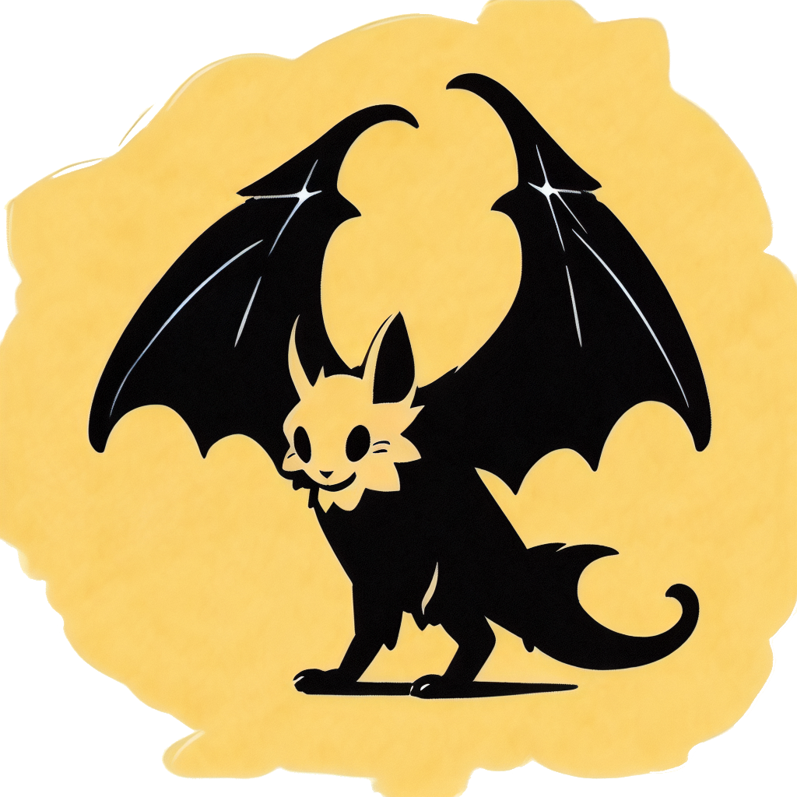

# Nighta

language: [中文](./README.md) | [ENGLISH](.)

<div style="text-align: center;">
  
</div>

`Nighta` is a lightweight scripting language, with its name signifying "something created overnight."

## Code Sample

```nighta
  (var msg1 "Hello,")
  (var msg2 "World!")
  (say (msg1 + msg2))
```

## Quick Start
Currently, we can code with Nighta in the [Playground](https://coderserio.github.io/Nighta/#/playground/)

## Document
Read [Document](https://coderserio.github.io/Nighta/#/) to learn about Nighta more!

## Contribution Guide
Eager to contribute to Nighta's growth? It might not be the time just yet...